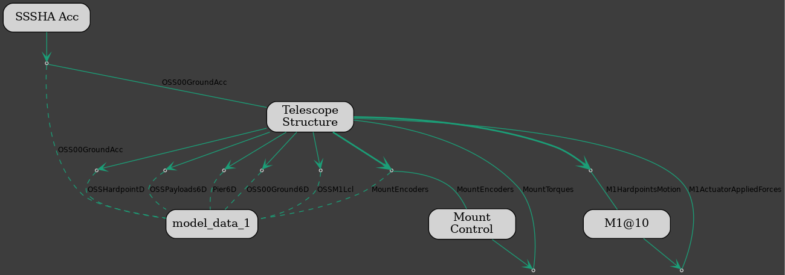
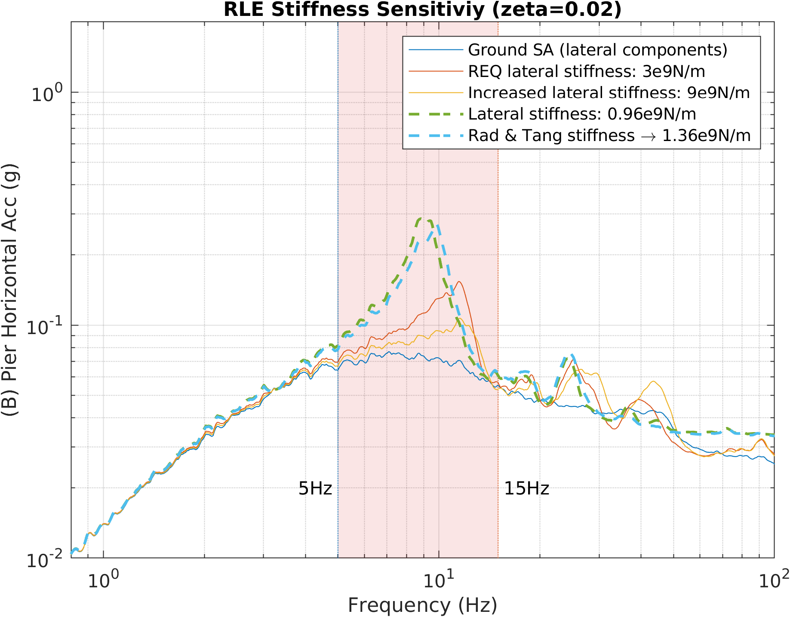

# GMT Integrated Modeling for Seismic Analyses

This repository provides the code to simulate the effect of RLE seismic events on the GMT. The simulations employ the [dos-actors](https://rconan.github.io/dos-actors/) framework based on the [Rust](https://www.rust-lang.org/) programming language.

The RLE ground accelerations available from the [1K RLE SSSHA release](https://github.com/GMTO/seismic/releases) must be copied to the [gmt-im-seismic/data/](https://github.com/GMTO-Integrated-Modeling/gmt-im-seismic/tree/main/data) folder to run the simulations. Those files have ground acceleration time series upsampled to 1KHz (see CR-05354 for details on the upsampling method). Simulations also require a zip file containing the modal model and the static solution of the telescope FEM. 
Structural model files are available both on the shared drive `drobo-im.gmto.org/im` in the `Integrated Modeling/gmt-im-seismic` folder an in the AWS GMT-IM s3 drive. 
The environmental variable `FEM_REPO` specifies the location of the zip file.




The simulation results are recorded in a parquet file in the data folder. The following signals are registered:
- **OSS00GroundAcc** (3): ground accelerations (along x, y, and z axes of the OSS coordinate system, respectively) applied to the structural model.
- **OSS00Ground6D** (6): rigid-body motions (TxyzRxyz) of the node in the pier interface ("large" mass element).
- **Pier6D** (12): rigid-body motions of two nodes in the pier. The first six are Txyz and Rxyz, respectively, of the node at the bottom, and the last six correspond to the node at the top of the pier.
- **OSSPayloads6D** (162): rigid-body motions of 27 payloads. The definition of the payloads is available in `/data/model_payload_list.txt`.
- **OSSHardpointD** (84): axial displacements of nodes at the hardpoints. Those displacements can be split into seven chunks (one for each M1 segment) of dimension 12. The first six elements are the displacements of the node on the cell (towards the mirror), and the last six correspond to the node on the mirror.
- **OSSM1Lcl** (42): rigid-body motions of the M1 segments represented in the local coordinate system. The ordering is S1-TxyzRxyz, S2-TxyzRxyz, ..., S7-TxyzRxyz. 
- **MountEncoders** (14): relative displacements of the mount main axes measured by encoders. The first four elements are the measurements of the azimuth encoders. The elevation encoder displacements are from the 5th to the 10th element, and the last four correspond to the GIR measurements.

A Python notebook (`processing.ipynb`) can be used to visualize the data and perform preliminary evaluation. The MatLab script (`assess_sssha_dt.m`) produces a collection of plots to analyze the simulation results thoroughly. The script (`rle_latKs_sensitivity.m`) uses simulation results of different telescope structural models to compare the spectral acceleration (SA) of the bottom of the pier. The following plot compares the SA of the node at the bottom of the pier resulting from models with different seismic isolator lateral stiffness.



The considered FEM models and the corresponding lateral stiffness value are reported in the table below. 

| FEM ID | SIS lateral stiffness [N/m] |
|:---:|:------------------:|
| 20240408_1535 | 0.96e9 |
| 20241003_1800 | 1.36e9 |
| 20230817_1808 | 3.00e9 |
| 20241021_1535 | 9.00e9 |

The simulation can be run with:
```
MOUNT_MODEL=MOUNT_FDR_1kHz FEM_REPO=<path-to-fem-repo> cargo run --release
```
where `<path-to-fem-repo>` has to be replaced with the local path.
The simulation iterates through each of the RLE acceleration time series.


